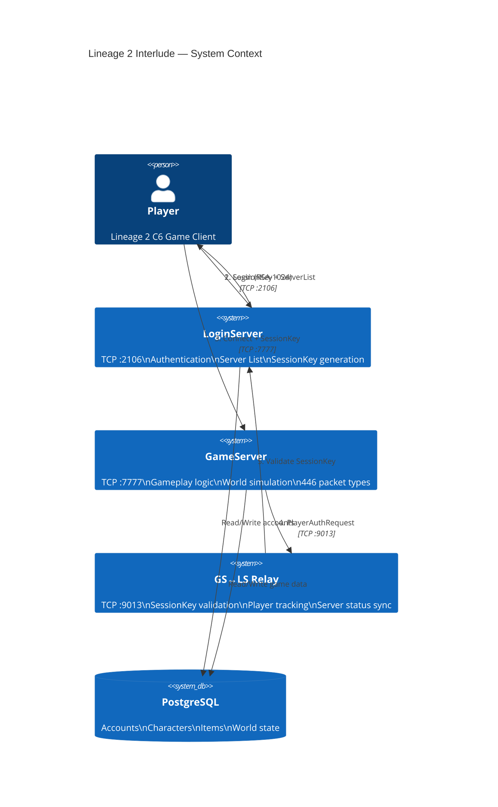
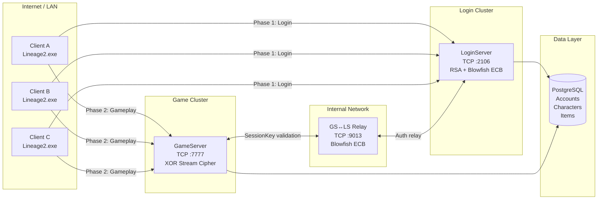
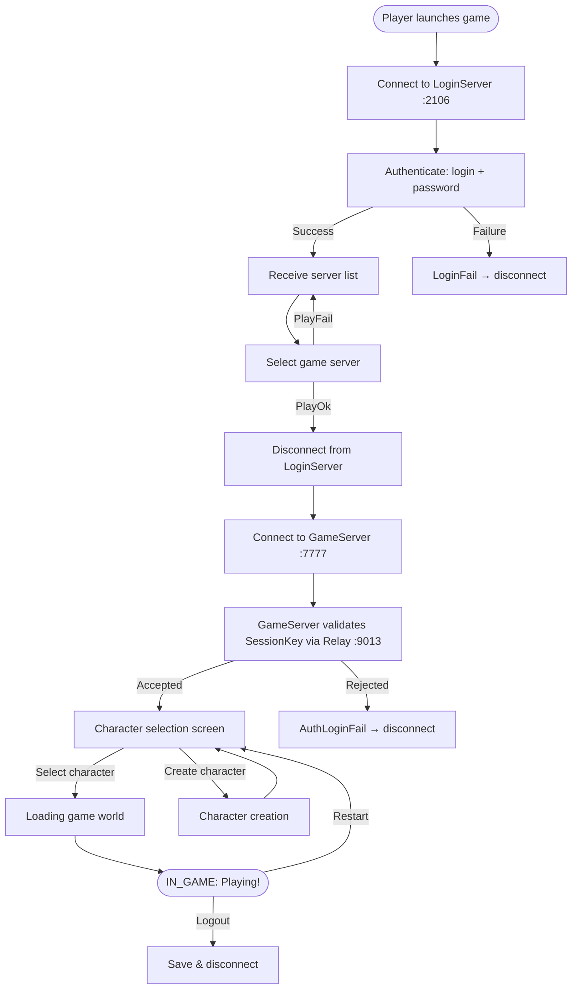

# L2 Interlude Protocol — Overview

> Part 0 of [L2 Interlude Protocol Reference](README.md)

---

## 1. Executive Summary

### What is Lineage 2 Interlude?

Lineage 2 Chronicle: Interlude (C6) is a massively multiplayer online role-playing game (MMORPG) released by NCSoft in 2007. The game uses a custom binary TCP protocol for all client-server communication.

### Protocol at a Glance

| Metric | Value |
|--------|-------|
| Total packets | **476** (177 C→S + 269 S→C + 17 Login + 13 GS↔LS Relay) |
| Encryption layers | **3** (RSA-1024, Blowfish ECB, XOR Stream) |
| Server processes | **3** (LoginServer, GameServer, GS↔LS Relay) |
| TCP ports | **3** (:2106 Login, :7777 Game, :9013 Relay) |
| GameClient states | **6** (CONNECTED → IN_GAME → DISCONNECTED) |
| LoginClient states | **3** (CONNECTED → AUTHED_GG → AUTHED_LOGIN) |
| Protocol revision | `0x0000C621` (Interlude) |
| Byte order | **Little-Endian** throughout |
| String encoding | **UTF-16LE** null-terminated |

### Three-Server Architecture

The L2 Interlude server consists of three independent TCP services:

1. **LoginServer** (:2106) — Authenticates game clients, manages accounts, provides server list
2. **GameServer** (:7777) — Handles all gameplay: movement, combat, inventory, social
3. **GS↔LS Relay** (:9013) — Internal channel for SessionKey validation between servers

### How a Player Connects (30-second overview)

```
1. Player launches Lineage2.exe
2. Client connects to LoginServer :2106
3. Client sends login/password (RSA-1024 encrypted)
4. LoginServer validates credentials → sends SessionKey (4× int32)
5. Client selects game server from list → receives PlayOk
6. Client disconnects from LoginServer
7. Client connects to GameServer :7777
8. Client sends SessionKey for validation
9. GameServer validates SessionKey via Relay :9013
10. Client selects character → enters game world
```

### Document Navigation

| Section | What you'll learn |
|---------|-------------------|
| [Architecture](#2-architecture-overview) | Who connects where, physical topology |
| [Cryptography](01-crypto.md) | How data is encrypted at each phase |
| [Sequences](02-protocol-flows.md#4-sequence-diagrams) | Step-by-step packet flows |
| [State Machines](02-protocol-flows.md#5-state-machines-fsm) | Connection lifecycle, allowed packets per state |
| [Use Cases](02-protocol-flows.md#6-use-case-scenarios) | Real gameplay scenarios: combat, trade, chat |
| [Packet Tables](03-packet-reference.md) | All 476 packets with opcodes and categories |
| [Binary Structures](03-packet-reference.md#8-binary-packet-structures) | Byte-level packet layouts |
| [Security](04-design-and-appendix.md#11-security-considerations) | Known weaknesses and mitigations |

---

## 2. Architecture Overview

### 2.1 System Context



### 2.2 Connection Topology



### 2.3 Connection Lifecycle Overview



### 2.4 Encryption by Connection Type

| Connection | Port | Encryption | Key Exchange |
|------------|------|------------|--------------|
| Client → LoginServer | :2106 | Blowfish ECB (static → dynamic) | RSA-1024 scrambled modulus in Init packet |
| Client → GameServer | :7777 | XOR Stream Cipher (16-byte rolling key) | Key sent in plaintext KeyPacket |
| GameServer → LoginServer | :9013 | Blowfish ECB (RSA-exchanged key) | RSA-512 encrypted Blowfish key |

---

> Next: [01-crypto.md](01-crypto.md) — Cryptography Deep Dive
