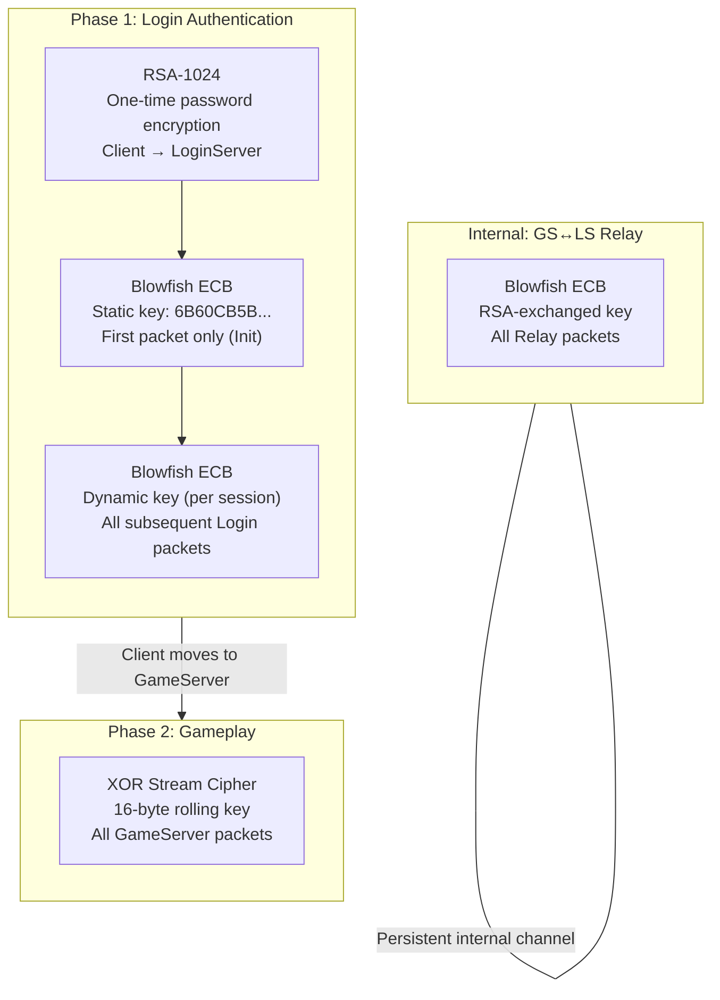
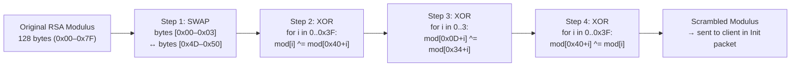
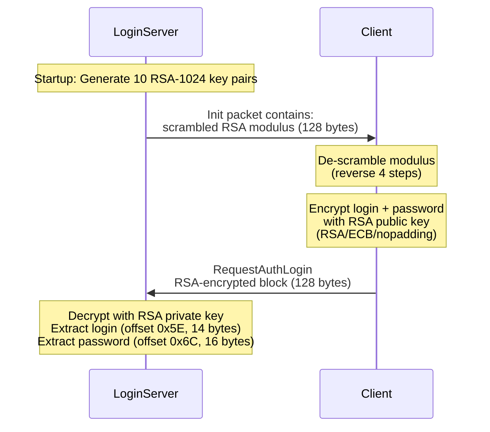
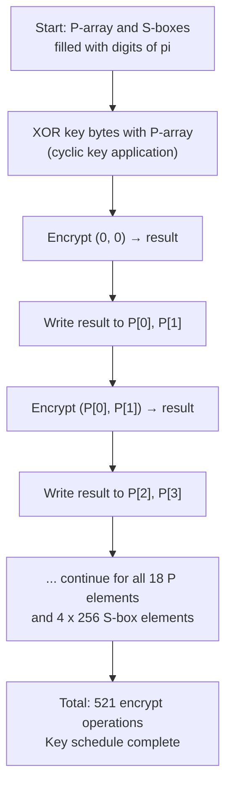
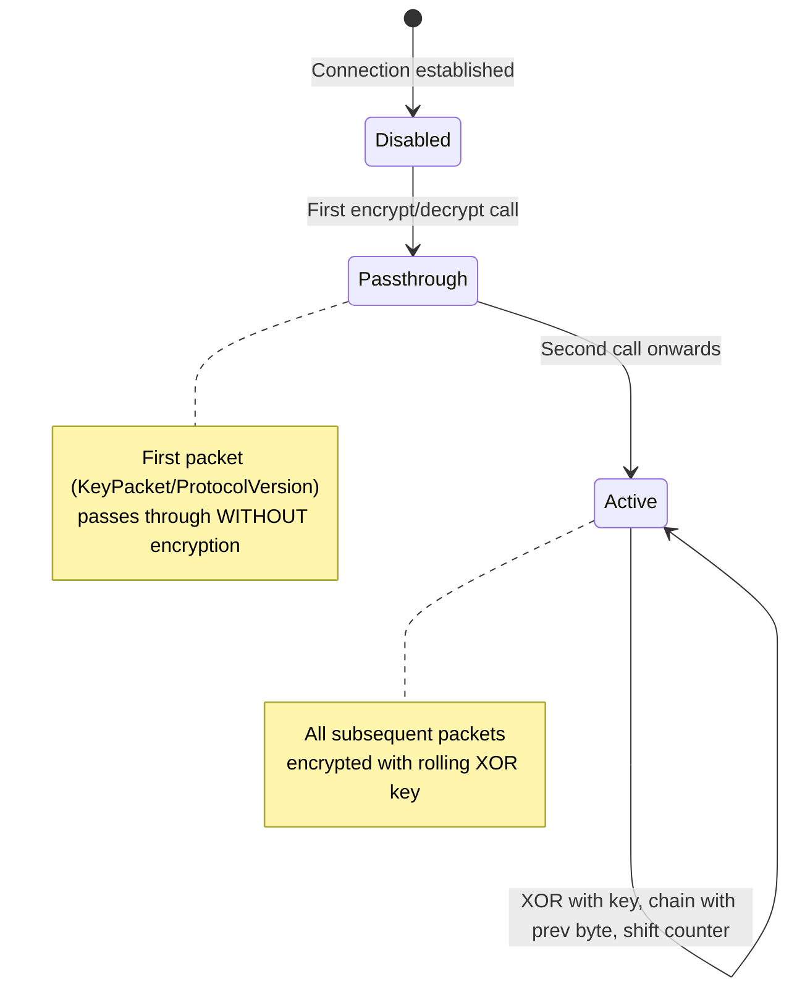
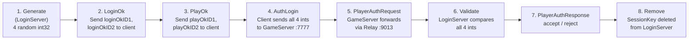
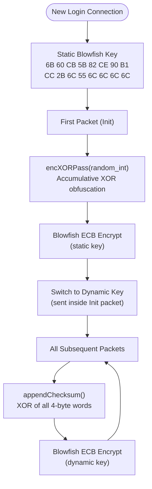

# L2 Interlude Protocol — Cryptography Deep Dive

> Part 1 of [L2 Interlude Protocol Reference](README.md)
> Previous: [00-overview.md](00-overview.md) | Next: [02-protocol-flows.md](02-protocol-flows.md)

---

## 3. Cryptography Deep Dive

### 3.1 Encryption Layers Overview

The protocol uses three different encryption algorithms at different phases. They are **never nested** — each applies to a specific connection phase.



### 3.2 RSA-1024 Key Exchange

RSA is used **exactly once** during login — to encrypt the player's password.

#### Key Generation (Server Startup)

- LoginServer generates **10 RSA-1024 key pairs** at startup
- Public exponent: **F4** (65537 = 0x10001)
- Modulus: **128 bytes** (1024 bits)
- A random key pair is selected for each client connection

#### Modulus Scrambling (4-Step Obfuscation)

Before sending the RSA public key to the client, the modulus undergoes a 4-step XOR/swap scrambling process. The client performs the reverse operations to recover the original modulus.



#### RSA Flow



### 3.3 Blowfish ECB

Blowfish is the primary encryption for LoginServer packets and the GS↔LS relay channel.

#### Algorithm Parameters

| Parameter | Value |
|-----------|-------|
| Type | Block cipher (Feistel network) |
| Block size | 8 bytes (64 bits) |
| Rounds | 16 |
| P-array | 18 elements (32-bit words) |
| S-boxes | 4 tables × 256 elements each |
| Key schedule | 521 encryption operations |

#### Blowfish Key Schedule



#### Feistel Round (x16)

```
Each round:
  xL ^= P[i]
  xR ^= F(xL)
  swap(xL, xR)

After 16 rounds:
  xL ^= P[16]
  xR ^= P[17]

F(x) = ((S0[byte3] + S1[byte2]) XOR S2[byte1]) + S3[byte0]
```

#### Checksum (Before Encryption)

Before Blowfish encryption, a 4-byte XOR checksum is appended:

```
checksum = 0
for each 4-byte word in data (except last 4 bytes):
    checksum ^= word
write checksum to last 4 bytes
```

Verification: XOR of all words including checksum = **0**.

#### encXORPass (First Packet Only)

An additional obfuscation layer applied only to the **Init packet**:

```
ecx = random_key  (4-byte int)
for each 4-byte word in data:
    edx = read_int32(data, i)
    ecx += edx
    edx ^= ecx
    write_int32(data, i, edx)
```

This creates a **chain dependency** — each block depends on all previous blocks.

#### Keys Used with Blowfish

| Key | Size | Source | Used For |
|-----|------|--------|----------|
| Static key | 16 bytes | Hardcoded: `6B 60 CB 5B 82 CE 90 B1 CC 2B 6C 55 6C 6C 6C 6C` | First packet (Init) from LoginServer |
| Dynamic key (Login) | 16 bytes | Random from pool of 20 | All Login packets after Init |
| Relay key | 16+ bytes | RSA-encrypted exchange | GS↔LS relay channel |

### 3.4 XOR Stream Cipher

After connecting to GameServer, all packets are encrypted with a lightweight XOR stream cipher.

#### XOR Encryption Formula

```
encrypt: out[i] = raw[i] XOR key[i & 0x0F] XOR out[i-1]
decrypt: raw[i] = enc[i] XOR key[i & 0x0F] XOR enc[i-1]

where out[-1] = 0 (initial value)
```

#### Key Shift (After Each Packet)

```
counter = key[8..11] as uint32_le
counter += packet_size
key[8..11] = counter as bytes_le
```

This ensures identical packets encrypt differently depending on position in the stream.

#### XOR Key Structure

| Bytes | Initial Value | Runtime Role | Description |
|-------|---------------|--------------|-------------|
| 0–7 | Random | XOR key bytes | Generated per connection (1–255 each byte) |
| 8–11 | `C8 27 93 01` | **Counter** | Static at generation; at runtime incremented by packet size after each encrypt/decrypt |
| 12–15 | `A1 6C 31 97` | Static suffix | Never modified during session |

> **Note:** At key pool generation (20 keys), bytes 8–15 are all set to the static suffix `C8 27 93 01 A1 6C 31 97`. At runtime, bytes 8–11 are repurposed as a 32-bit LE counter (key shift), while bytes 12–15 remain constant.

#### XOR State Machine



### 3.5 SessionKey Lifecycle

The SessionKey is a **one-time token** (4 x int32 = 128 bits) that links Login and GameServer authentication.



#### SessionKey Fields

| Field | Size | Set By | Sent In |
|-------|------|--------|---------|
| loginOkID1 | int32 | LoginServer | LoginOk (0x03) |
| loginOkID2 | int32 | LoginServer | LoginOk (0x03) |
| playOkID1 | int32 | LoginServer | PlayOk (0x07) |
| playOkID2 | int32 | LoginServer | PlayOk (0x07) |

### 3.6 LoginEncryption (Two-Stage Blowfish)

LoginServer uses two different Blowfish modes depending on packet order:



### 3.7 All Keys Summary

| Key | Size | Source | Lifetime | Purpose |
|-----|------|--------|----------|---------|
| RSA private key | 1024 bit | Generated at LS startup (10 pairs) | Process lifetime | Decrypt client password |
| RSA public key (scrambled) | 1024 bit | Sent in Init packet | One session | Client encrypts password |
| Blowfish static key | 16 bytes | Hardcoded in client & server | Permanent | Init packet encryption |
| Blowfish dynamic key (Login) | 16 bytes | Random from pool of 20 | One login session | Login packets after Init |
| Blowfish relay key | 16+ bytes | RSA-exchanged at GS registration | GS↔LS session | All relay packets |
| XOR stream key | 16 bytes | Sent in KeyPacket | One game session | All GameServer packets |
| SessionKey | 4 x int32 | Random, generated by LS | One auth cycle | Link Login→Game auth |
| encXORPass key | 4 bytes (int) | Random | One packet | Init packet obfuscation |

---

> Previous: [00-overview.md](00-overview.md) | Next: [02-protocol-flows.md](02-protocol-flows.md)
