# L2 Interlude Protocol — Protocol Flows

> Part 2 of [L2 Interlude Protocol Reference](README.md)
> Previous: [01-crypto.md](01-crypto.md) | Next: [03-packet-reference.md](03-packet-reference.md)

---

## 4. Sequence Diagrams

### 4.1 Login Flow (Client → LoginServer :2106)

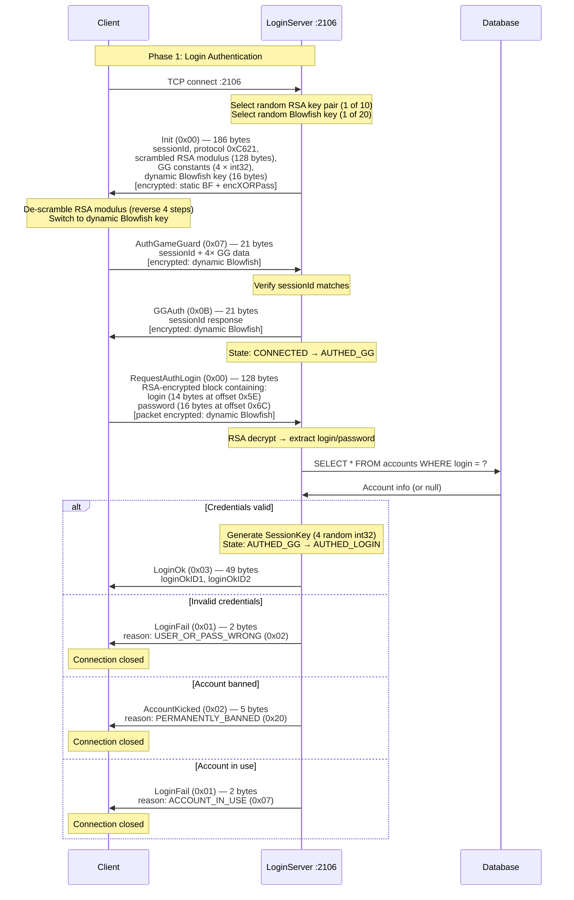
```mermaid
sequenceDiagram
    participant C as Client
    participant LS as LoginServer :2106
    participant DB as Database

    Note over C,LS: Phase 1: Login Authentication

    C->>LS: TCP connect :2106

    Note over LS: Select random RSA key pair (1 of 10)<br/>Select random Blowfish key (1 of 20)

    LS->>C: Init (0x00) — 186 bytes<br/>sessionId, protocol 0xC621,<br/>scrambled RSA modulus (128 bytes),<br/>GG constants (4 × int32),<br/>dynamic Blowfish key (16 bytes)<br/>[encrypted: static BF + encXORPass]

    Note over C: De-scramble RSA modulus (reverse 4 steps)<br/>Switch to dynamic Blowfish key

    C->>LS: AuthGameGuard (0x07) — 21 bytes<br/>sessionId + 4× GG data<br/>[encrypted: dynamic Blowfish]

    Note over LS: Verify sessionId matches

    LS->>C: GGAuth (0x0B) — 21 bytes<br/>sessionId response<br/>[encrypted: dynamic Blowfish]

    Note over LS: State: CONNECTED → AUTHED_GG

    C->>LS: RequestAuthLogin (0x00) — 128 bytes<br/>RSA-encrypted block containing:<br/>  login (14 bytes at offset 0x5E)<br/>  password (16 bytes at offset 0x6C)<br/>[packet encrypted: dynamic Blowfish]

    Note over LS: RSA decrypt → extract login/password

    LS->>DB: SELECT * FROM accounts WHERE login = ?
    DB->>LS: Account info (or null)

    alt Credentials valid
        Note over LS: Generate SessionKey (4 random int32)<br/>State: AUTHED_GG → AUTHED_LOGIN
        LS->>C: LoginOk (0x03) — 49 bytes<br/>loginOkID1, loginOkID2
    else Invalid credentials
        LS->>C: LoginFail (0x01) — 2 bytes<br/>reason: USER_OR_PASS_WRONG (0x02)
        Note over C: Connection closed
    else Account banned
        LS->>C: AccountKicked (0x02) — 5 bytes<br/>reason: PERMANENTLY_BANNED (0x20)
        Note over C: Connection closed
    else Account in use
        LS->>C: LoginFail (0x01) — 2 bytes<br/>reason: ACCOUNT_IN_USE (0x07)
        Note over C: Connection closed
    end
```

### 4.2 Server Selection Flow

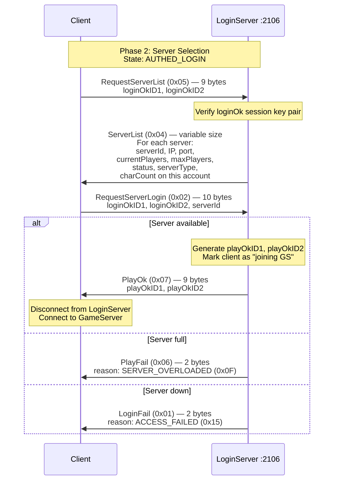
```mermaid
sequenceDiagram
    participant C as Client
    participant LS as LoginServer :2106

    Note over C,LS: Phase 2: Server Selection<br/>State: AUTHED_LOGIN

    C->>LS: RequestServerList (0x05) — 9 bytes<br/>loginOkID1, loginOkID2

    Note over LS: Verify loginOk session key pair

    LS->>C: ServerList (0x04) — variable size<br/>For each server:<br/>  serverId, IP, port,<br/>  currentPlayers, maxPlayers,<br/>  status, serverType,<br/>  charCount on this account

    C->>LS: RequestServerLogin (0x02) — 10 bytes<br/>loginOkID1, loginOkID2, serverId

    alt Server available
        Note over LS: Generate playOkID1, playOkID2<br/>Mark client as "joining GS"
        LS->>C: PlayOk (0x07) — 9 bytes<br/>playOkID1, playOkID2
        Note over C: Disconnect from LoginServer<br/>Connect to GameServer
    else Server full
        LS->>C: PlayFail (0x06) — 2 bytes<br/>reason: SERVER_OVERLOADED (0x0F)
    else Server down
        LS->>C: LoginFail (0x01) — 2 bytes<br/>reason: ACCESS_FAILED (0x15)
    end
```

### 4.3 GameServer Connection Flow (Client → GameServer :7777)

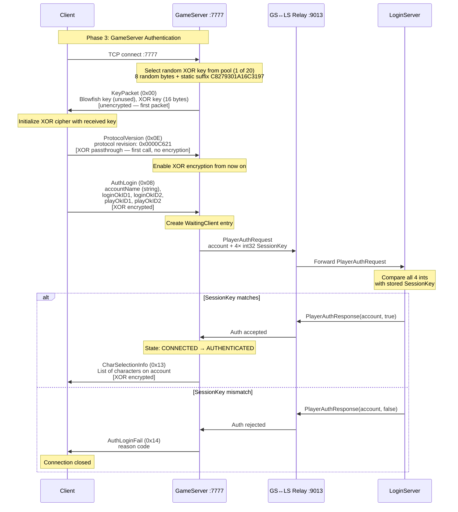
```mermaid
sequenceDiagram
    participant C as Client
    participant GS as GameServer :7777
    participant RELAY as GS↔LS Relay :9013
    participant LS as LoginServer

    Note over C,GS: Phase 3: GameServer Authentication

    C->>GS: TCP connect :7777

    Note over GS: Select random XOR key from pool (1 of 20)<br/>8 random bytes + static suffix C8279301A16C3197

    GS->>C: KeyPacket (0x00)<br/>Blowfish key (unused), XOR key (16 bytes)<br/>[unencrypted — first packet]

    Note over C: Initialize XOR cipher with received key

    C->>GS: ProtocolVersion (0x0E)<br/>protocol revision: 0x0000C621<br/>[XOR passthrough — first call, no encryption]

    Note over GS: Enable XOR encryption from now on

    C->>GS: AuthLogin (0x08)<br/>accountName (string),<br/>loginOkID1, loginOkID2,<br/>playOkID1, playOkID2<br/>[XOR encrypted]

    Note over GS: Create WaitingClient entry

    GS->>RELAY: PlayerAuthRequest<br/>account + 4× int32 SessionKey

    RELAY->>LS: Forward PlayerAuthRequest

    Note over LS: Compare all 4 ints<br/>with stored SessionKey

    alt SessionKey matches
        LS->>RELAY: PlayerAuthResponse(account, true)
        RELAY->>GS: Auth accepted
        Note over GS: State: CONNECTED → AUTHENTICATED
        GS->>C: CharSelectionInfo (0x13)<br/>List of characters on account<br/>[XOR encrypted]
    else SessionKey mismatch
        LS->>RELAY: PlayerAuthResponse(account, false)
        RELAY->>GS: Auth rejected
        GS->>C: AuthLoginFail (0x14)<br/>reason code
        Note over C: Connection closed
    end
```

### 4.4 GS↔LS Relay Registration Flow (TCP :9013)

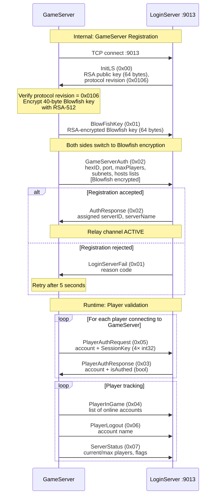
```mermaid
sequenceDiagram
    participant GS as GameServer
    participant LS as LoginServer :9013

    Note over GS,LS: Internal: GameServer Registration

    GS->>LS: TCP connect :9013

    LS->>GS: InitLS (0x00)<br/>RSA public key (64 bytes),<br/>protocol revision (0x0106)

    Note over GS: Verify protocol revision = 0x0106<br/>Encrypt 40-byte Blowfish key<br/>with RSA-512

    GS->>LS: BlowFishKey (0x01)<br/>RSA-encrypted Blowfish key (64 bytes)

    Note over GS,LS: Both sides switch to Blowfish encryption

    GS->>LS: GameServerAuth (0x02)<br/>hexID, port, maxPlayers,<br/>subnets, hosts lists<br/>[Blowfish encrypted]

    alt Registration accepted
        LS->>GS: AuthResponse (0x02)<br/>assigned serverID, serverName
        Note over GS,LS: Relay channel ACTIVE
    else Registration rejected
        LS->>GS: LoginServerFail (0x01)<br/>reason code
        Note over GS: Retry after 5 seconds
    end

    Note over GS,LS: Runtime: Player validation

    loop For each player connecting to GameServer
        GS->>LS: PlayerAuthRequest (0x05)<br/>account + SessionKey (4× int32)
        LS->>GS: PlayerAuthResponse (0x03)<br/>account + isAuthed (bool)
    end

    loop Player tracking
        GS->>LS: PlayerInGame (0x04)<br/>list of online accounts
        GS->>LS: PlayerLogout (0x06)<br/>account name
        GS->>LS: ServerStatus (0x07)<br/>current/max players, flags
    end
```

### 4.5 Full End-to-End Flow (All Three Servers)

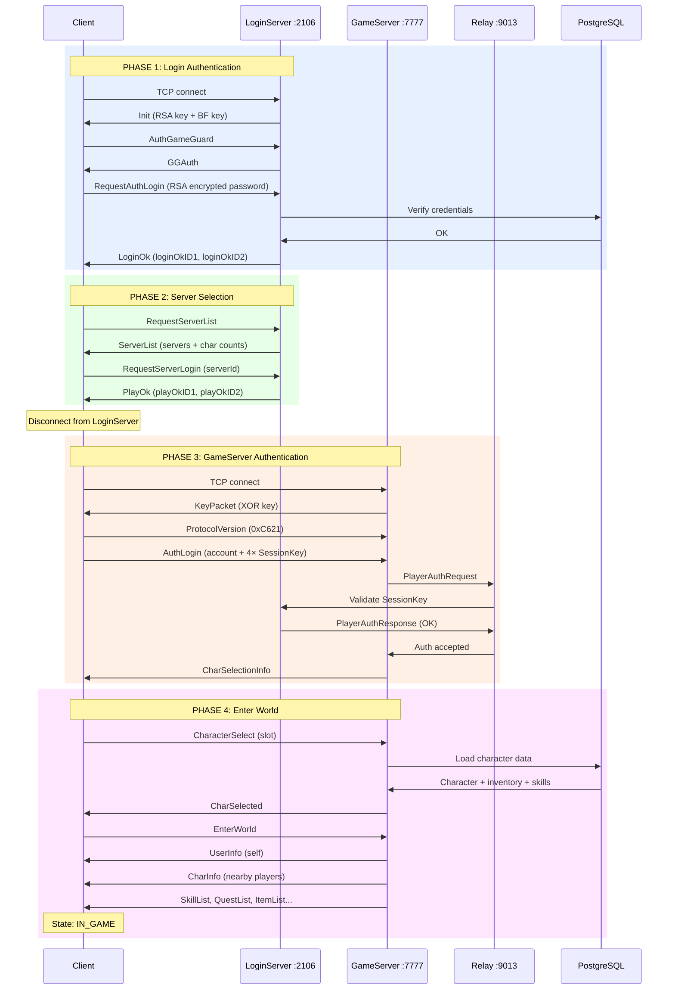
```mermaid
sequenceDiagram
    participant C as Client
    participant LS as LoginServer :2106
    participant GS as GameServer :7777
    participant R as Relay :9013
    participant DB as PostgreSQL

    rect rgb(230, 240, 255)
        Note over C,LS: PHASE 1: Login Authentication
        C->>LS: TCP connect
        LS->>C: Init (RSA key + BF key)
        C->>LS: AuthGameGuard
        LS->>C: GGAuth
        C->>LS: RequestAuthLogin (RSA encrypted password)
        LS->>DB: Verify credentials
        DB->>LS: OK
        LS->>C: LoginOk (loginOkID1, loginOkID2)
    end

    rect rgb(230, 255, 230)
        Note over C,LS: PHASE 2: Server Selection
        C->>LS: RequestServerList
        LS->>C: ServerList (servers + char counts)
        C->>LS: RequestServerLogin (serverId)
        LS->>C: PlayOk (playOkID1, playOkID2)
    end

    Note over C: Disconnect from LoginServer

    rect rgb(255, 240, 230)
        Note over C,GS: PHASE 3: GameServer Authentication
        C->>GS: TCP connect
        GS->>C: KeyPacket (XOR key)
        C->>GS: ProtocolVersion (0xC621)
        C->>GS: AuthLogin (account + 4× SessionKey)
        GS->>R: PlayerAuthRequest
        R->>LS: Validate SessionKey
        LS->>R: PlayerAuthResponse (OK)
        R->>GS: Auth accepted
        GS->>C: CharSelectionInfo
    end

    rect rgb(255, 230, 255)
        Note over C,GS: PHASE 4: Enter World
        C->>GS: CharacterSelect (slot)
        GS->>DB: Load character data
        DB->>GS: Character + inventory + skills
        GS->>C: CharSelected
        C->>GS: EnterWorld
        GS->>C: UserInfo (self)
        GS->>C: CharInfo (nearby players)
        GS->>C: SkillList, QuestList, ItemList...
        Note over C: State: IN_GAME
    end
```

### 4.6 Enter World Flow (GameServer)

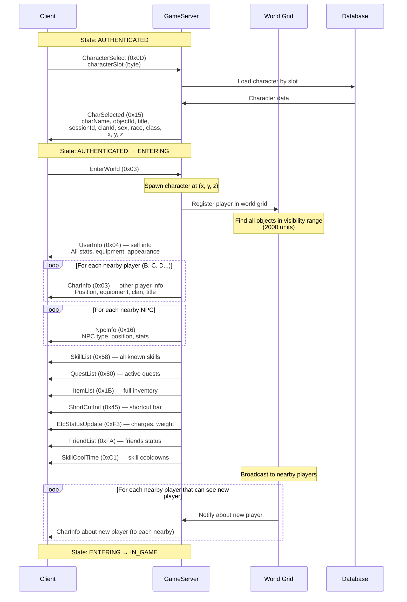
```mermaid
sequenceDiagram
    participant C as Client
    participant GS as GameServer
    participant W as World Grid
    participant DB as Database

    Note over C,GS: State: AUTHENTICATED

    C->>GS: CharacterSelect (0x0D)<br/>characterSlot (byte)

    GS->>DB: Load character by slot
    DB->>GS: Character data

    GS->>C: CharSelected (0x15)<br/>charName, objectId, title,<br/>sessionId, clanId, sex, race, class,<br/>x, y, z

    Note over C,GS: State: AUTHENTICATED → ENTERING

    C->>GS: EnterWorld (0x03)

    Note over GS: Spawn character at (x, y, z)

    GS->>W: Register player in world grid

    Note over W: Find all objects in visibility range<br/>(2000 units)

    GS->>C: UserInfo (0x04) — self info<br/>All stats, equipment, appearance

    loop For each nearby player (B, C, D...)
        GS->>C: CharInfo (0x03) — other player info<br/>Position, equipment, clan, title
    end

    loop For each nearby NPC
        GS->>C: NpcInfo (0x16)<br/>NPC type, position, stats
    end

    GS->>C: SkillList (0x58) — all known skills
    GS->>C: QuestList (0x80) — active quests
    GS->>C: ItemList (0x1B) — full inventory
    GS->>C: ShortCutInit (0x45) — shortcut bar
    GS->>C: EtcStatusUpdate (0xF3) — charges, weight
    GS->>C: FriendList (0xFA) — friends status
    GS->>C: SkillCoolTime (0xC1) — skill cooldowns

    Note over W: Broadcast to nearby players

    loop For each nearby player that can see new player
        W->>GS: Notify about new player
        GS-->>C: CharInfo about new player (to each nearby)
    end

    Note over C,GS: State: ENTERING → IN_GAME
```

---

## 5. State Machines (FSM)

### 5.1 LoginClient ConnectionState

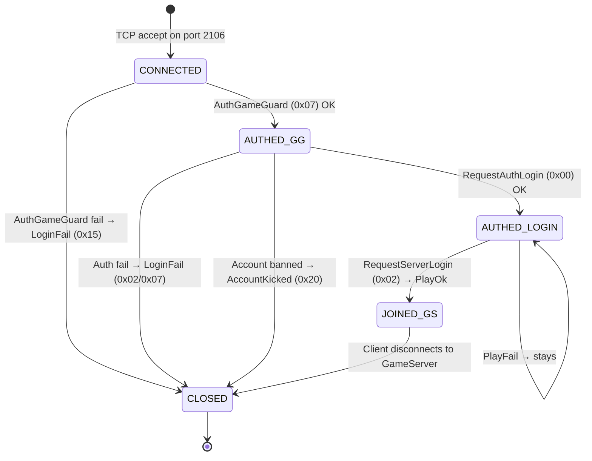
```mermaid
stateDiagram-v2
    [*] --> CONNECTED : TCP accept on port 2106

    CONNECTED --> AUTHED_GG : AuthGameGuard (0x07) OK
    CONNECTED --> CLOSED : AuthGameGuard fail → LoginFail (0x15)

    AUTHED_GG --> AUTHED_LOGIN : RequestAuthLogin (0x00) OK
    AUTHED_GG --> CLOSED : Auth fail → LoginFail (0x02/0x07)
    AUTHED_GG --> CLOSED : Account banned → AccountKicked (0x20)

    AUTHED_LOGIN --> AUTHED_LOGIN : RequestServerList (0x05) → ServerList
    AUTHED_LOGIN --> JOINED_GS : RequestServerLogin (0x02) → PlayOk
    AUTHED_LOGIN --> AUTHED_LOGIN : PlayFail → stays

    JOINED_GS --> CLOSED : Client disconnects to GameServer

    CLOSED --> [*]
```

#### Allowed Packets by State (LoginServer)

| State | Allowed Client Packets | Server Response |
|-------|----------------------|-----------------|
| CONNECTED | AuthGameGuard (0x07) | GGAuth (0x0B) or LoginFail (0x01) |
| AUTHED_GG | RequestAuthLogin (0x00) | LoginOk (0x03) or LoginFail (0x01) or AccountKicked (0x02) |
| AUTHED_LOGIN | RequestServerList (0x05) | ServerList (0x04) |
| AUTHED_LOGIN | RequestServerLogin (0x02) | PlayOk (0x07) or PlayFail (0x06) |
| AUTHED_LOGIN | RequestPIAgreementCheck (0x0E) | PIAgreementCheck (0x11) |
| AUTHED_LOGIN | RequestPIAgreement (0x0F) | PIAgreementAck (0x12) |

### 5.2 GameClient ConnectionState

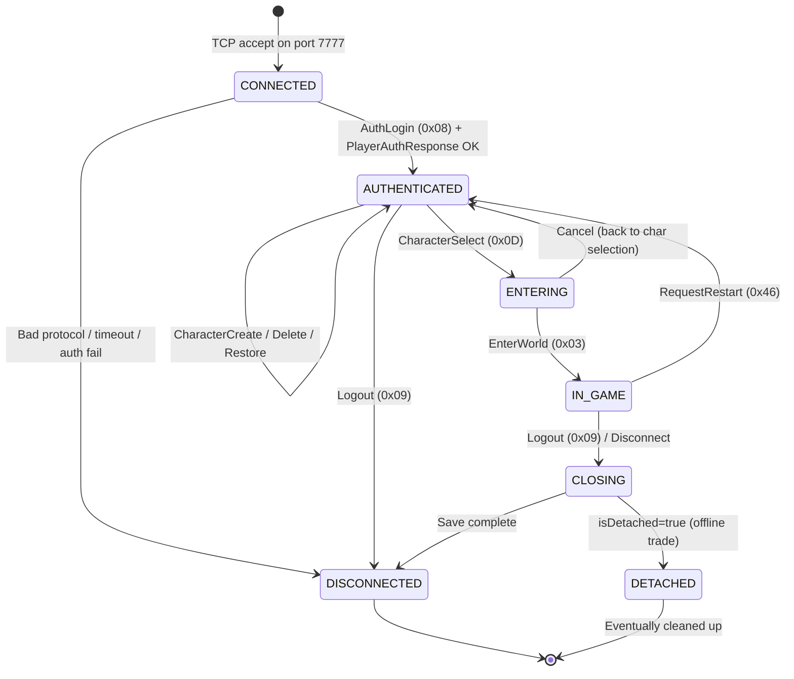
```mermaid
stateDiagram-v2
    [*] --> CONNECTED : TCP accept on port 7777

    CONNECTED --> AUTHENTICATED : AuthLogin (0x08) + PlayerAuthResponse OK
    CONNECTED --> DISCONNECTED : Bad protocol / timeout / auth fail

    AUTHENTICATED --> ENTERING : CharacterSelect (0x0D)
    AUTHENTICATED --> DISCONNECTED : Logout (0x09)
    AUTHENTICATED --> AUTHENTICATED : CharacterCreate / Delete / Restore

    ENTERING --> IN_GAME : EnterWorld (0x03)
    ENTERING --> AUTHENTICATED : Cancel (back to char selection)

    IN_GAME --> AUTHENTICATED : RequestRestart (0x46)
    IN_GAME --> CLOSING : Logout (0x09) / Disconnect

    CLOSING --> DISCONNECTED : Save complete
    CLOSING --> DETACHED : isDetached=true (offline trade)

    DISCONNECTED --> [*]
    DETACHED --> [*] : Eventually cleaned up
```

#### Allowed Packets by State (GameServer)

| State | Allowed Client Packets | Count |
|-------|----------------------|-------|
| CONNECTED | ProtocolVersion (0x00), AuthLogin (0x08) | 2 |
| AUTHENTICATED | CharacterCreate (0x0B), CharacterDelete (0x0C), CharacterSelect (0x0D), NewCharacter (0x0E), CharacterRestore (0x62), Logout (0x09), RequestPledgeCrest (0x68) | 7 |
| ENTERING | EnterWorld (0x03) | 1 |
| IN_GAME | All gameplay packets (~160 regular + ~46 Ex) | ~206 |

### 5.3 GS↔LS Relay ConnectionState

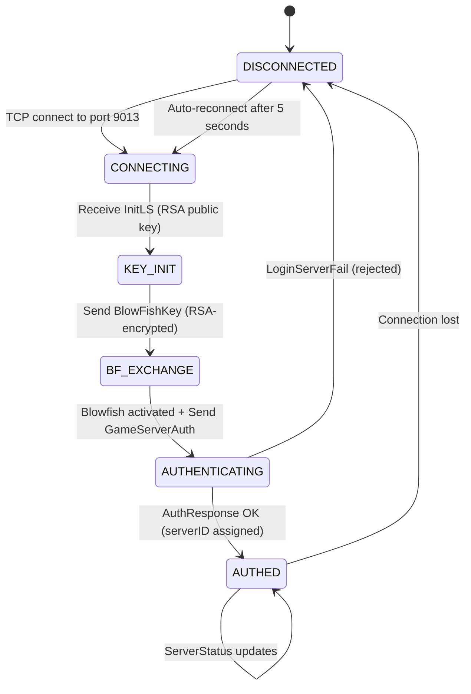
```mermaid
stateDiagram-v2
    [*] --> DISCONNECTED

    DISCONNECTED --> CONNECTING : TCP connect to port 9013

    CONNECTING --> KEY_INIT : Receive InitLS (RSA public key)

    KEY_INIT --> BF_EXCHANGE : Send BlowFishKey (RSA-encrypted)

    BF_EXCHANGE --> AUTHENTICATING : Blowfish activated + Send GameServerAuth

    AUTHENTICATING --> AUTHED : AuthResponse OK (serverID assigned)
    AUTHENTICATING --> DISCONNECTED : LoginServerFail (rejected)

    AUTHED --> AUTHED : PlayerAuthRequest / PlayerAuthResponse
    AUTHED --> AUTHED : PlayerInGame / PlayerLogout
    AUTHED --> AUTHED : ServerStatus updates

    AUTHED --> DISCONNECTED : Connection lost

    DISCONNECTED --> CONNECTING : Auto-reconnect after 5 seconds
```

---

## 6. Use Case Scenarios

### 6.1 Complete Login Journey

> What happens from double-clicking Lineage2.exe to appearing in the game world.

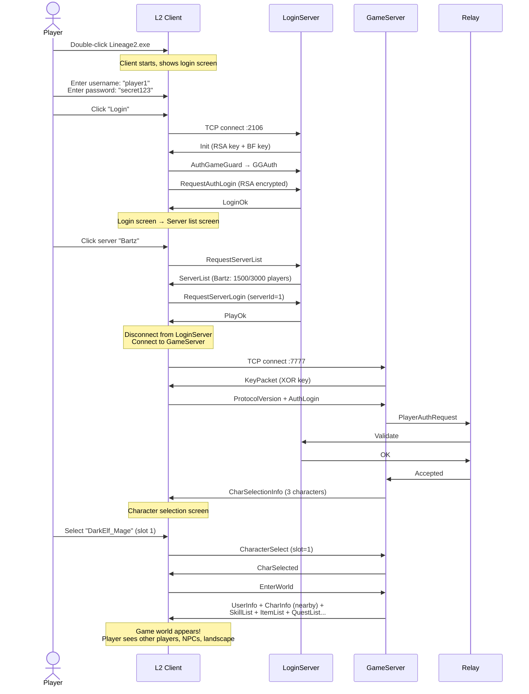
```mermaid
sequenceDiagram
    actor P as Player
    participant C as L2 Client
    participant LS as LoginServer
    participant GS as GameServer
    participant R as Relay

    P->>C: Double-click Lineage2.exe
    Note over C: Client starts, shows login screen

    P->>C: Enter username: "player1"<br/>Enter password: "secret123"
    P->>C: Click "Login"

    C->>LS: TCP connect :2106
    LS->>C: Init (RSA key + BF key)
    C->>LS: AuthGameGuard → GGAuth
    C->>LS: RequestAuthLogin (RSA encrypted)
    LS->>C: LoginOk

    Note over C: Login screen → Server list screen

    P->>C: Click server "Bartz"

    C->>LS: RequestServerList
    LS->>C: ServerList (Bartz: 1500/3000 players)
    C->>LS: RequestServerLogin (serverId=1)
    LS->>C: PlayOk

    Note over C: Disconnect from LoginServer<br/>Connect to GameServer

    C->>GS: TCP connect :7777
    GS->>C: KeyPacket (XOR key)
    C->>GS: ProtocolVersion + AuthLogin
    GS->>R: PlayerAuthRequest
    R->>LS: Validate
    LS->>R: OK
    R->>GS: Accepted
    GS->>C: CharSelectionInfo (3 characters)

    Note over C: Character selection screen

    P->>C: Select "DarkElf_Mage" (slot 1)

    C->>GS: CharacterSelect (slot=1)
    GS->>C: CharSelected
    C->>GS: EnterWorld

    GS->>C: UserInfo + CharInfo (nearby) +<br/>SkillList + ItemList + QuestList...

    Note over C: Game world appears!<br/>Player sees other players, NPCs, landscape
```

### 6.2 Player Movement & Broadcast

> What happens when Player A walks from point X to point Y, and how other players see it.

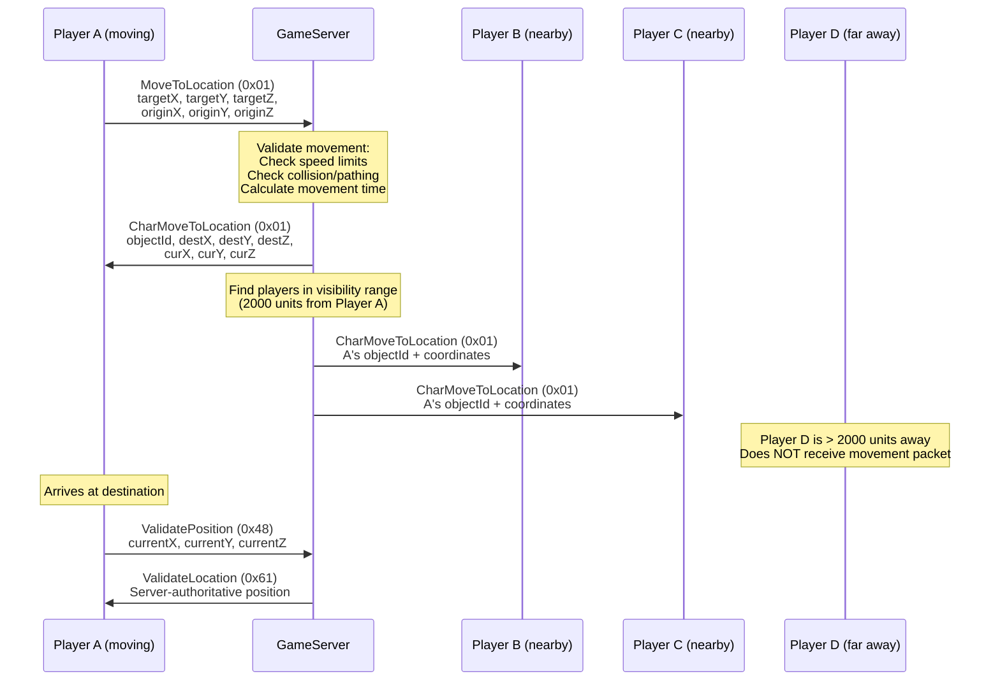
```mermaid
sequenceDiagram
    participant A as Player A (moving)
    participant GS as GameServer
    participant B as Player B (nearby)
    participant C as Player C (nearby)
    participant D as Player D (far away)

    A->>GS: MoveToLocation (0x01)<br/>targetX, targetY, targetZ,<br/>originX, originY, originZ

    Note over GS: Validate movement:<br/>Check speed limits<br/>Check collision/pathing<br/>Calculate movement time

    GS->>A: CharMoveToLocation (0x01)<br/>objectId, destX, destY, destZ,<br/>curX, curY, curZ

    Note over GS: Find players in visibility range<br/>(2000 units from Player A)

    GS->>B: CharMoveToLocation (0x01)<br/>A's objectId + coordinates
    GS->>C: CharMoveToLocation (0x01)<br/>A's objectId + coordinates

    Note over D: Player D is > 2000 units away<br/>Does NOT receive movement packet

    Note over A: Arrives at destination

    A->>GS: ValidatePosition (0x48)<br/>currentX, currentY, currentZ

    GS->>A: ValidateLocation (0x61)<br/>Server-authoritative position
```

### 6.3 Combat Scenario

> Player A attacks Player B — what packets are exchanged, who sees what.

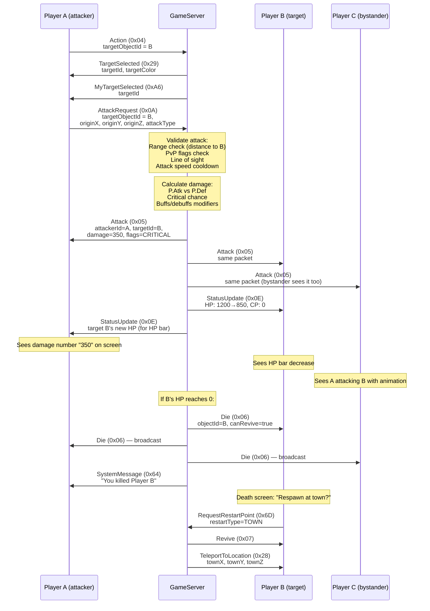
```mermaid
sequenceDiagram
    participant A as Player A (attacker)
    participant GS as GameServer
    participant B as Player B (target)
    participant C as Player C (bystander)

    A->>GS: Action (0x04)<br/>targetObjectId = B

    GS->>A: TargetSelected (0x29)<br/>targetId, targetColor

    GS->>A: MyTargetSelected (0xA6)<br/>targetId

    A->>GS: AttackRequest (0x0A)<br/>targetObjectId = B,<br/>originX, originY, originZ, attackType

    Note over GS: Validate attack:<br/>Range check (distance to B)<br/>PvP flags check<br/>Line of sight<br/>Attack speed cooldown

    Note over GS: Calculate damage:<br/>P.Atk vs P.Def<br/>Critical chance<br/>Buffs/debuffs modifiers

    GS->>A: Attack (0x05)<br/>attackerId=A, targetId=B,<br/>damage=350, flags=CRITICAL
    GS->>B: Attack (0x05)<br/>same packet
    GS->>C: Attack (0x05)<br/>same packet (bystander sees it too)

    GS->>B: StatusUpdate (0x0E)<br/>HP: 1200→850, CP: 0

    GS->>A: StatusUpdate (0x0E)<br/>target B's new HP (for HP bar)

    Note over A: Sees damage number "350" on screen
    Note over B: Sees HP bar decrease
    Note over C: Sees A attacking B with animation

    Note over GS: If B's HP reaches 0:

    GS->>B: Die (0x06)<br/>objectId=B, canRevive=true
    GS->>A: Die (0x06) — broadcast
    GS->>C: Die (0x06) — broadcast

    GS->>A: SystemMessage (0x64)<br/>"You killed Player B"

    Note over B: Death screen: "Respawn at town?"
    B->>GS: RequestRestartPoint (0x6D)<br/>restartType=TOWN

    GS->>B: Revive (0x07)
    GS->>B: TeleportToLocation (0x28)<br/>townX, townY, townZ
```

### 6.4 Chat Message Distribution

> Player A types a message — how it reaches other players depending on chat type.

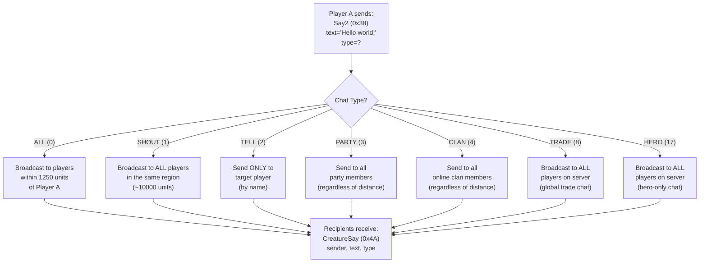
```mermaid
flowchart TD
    A["Player A sends:\nSay2 (0x38)\ntext='Hello world!'\ntype=?"] --> TYPE{Chat Type?}

    TYPE -->|"ALL (0)"| ALL["Broadcast to players\nwithin 1250 units\nof Player A"]
    TYPE -->|"SHOUT (1)"| SHOUT["Broadcast to ALL players\nin the same region\n(~10000 units)"]
    TYPE -->|"TELL (2)"| TELL["Send ONLY to\ntarget player\n(by name)"]
    TYPE -->|"PARTY (3)"| PARTY["Send to all\nparty members\n(regardless of distance)"]
    TYPE -->|"CLAN (4)"| CLAN["Send to all\nonline clan members\n(regardless of distance)"]
    TYPE -->|"TRADE (8)"| TRADE["Broadcast to ALL\nplayers on server\n(global trade chat)"]
    TYPE -->|"HERO (17)"| HERO["Broadcast to ALL\nplayers on server\n(hero-only chat)"]

    ALL --> RECV["Recipients receive:\nCreatureSay (0x4A)\nsender, text, type"]
    SHOUT --> RECV
    TELL --> RECV
    PARTY --> RECV
    CLAN --> RECV
    TRADE --> RECV
    HERO --> RECV
```

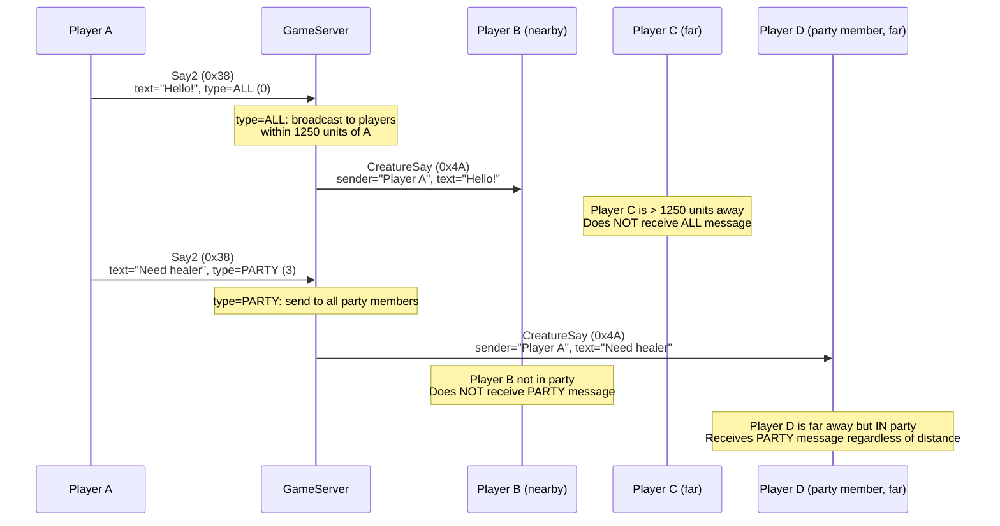
```mermaid
sequenceDiagram
    participant A as Player A
    participant GS as GameServer
    participant B as Player B (nearby)
    participant C as Player C (far)
    participant D as Player D (party member, far)

    A->>GS: Say2 (0x38)<br/>text="Hello!", type=ALL (0)

    Note over GS: type=ALL: broadcast to players<br/>within 1250 units of A

    GS->>B: CreatureSay (0x4A)<br/>sender="Player A", text="Hello!"
    Note over C: Player C is > 1250 units away<br/>Does NOT receive ALL message

    A->>GS: Say2 (0x38)<br/>text="Need healer", type=PARTY (3)

    Note over GS: type=PARTY: send to all party members

    GS->>D: CreatureSay (0x4A)<br/>sender="Player A", text="Need healer"
    Note over B: Player B not in party<br/>Does NOT receive PARTY message
    Note over D: Player D is far away but IN party<br/>Receives PARTY message regardless of distance
```

### 6.5 Trade Between Players

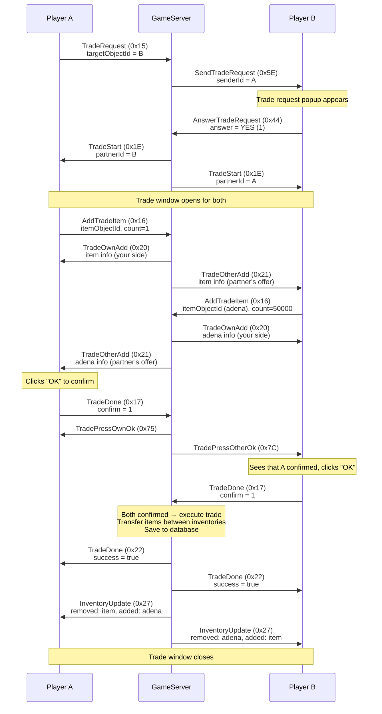
```mermaid
sequenceDiagram
    participant A as Player A
    participant GS as GameServer
    participant B as Player B

    A->>GS: TradeRequest (0x15)<br/>targetObjectId = B

    GS->>B: SendTradeRequest (0x5E)<br/>senderId = A

    Note over B: Trade request popup appears

    B->>GS: AnswerTradeRequest (0x44)<br/>answer = YES (1)

    GS->>A: TradeStart (0x1E)<br/>partnerId = B
    GS->>B: TradeStart (0x1E)<br/>partnerId = A

    Note over A,B: Trade window opens for both

    A->>GS: AddTradeItem (0x16)<br/>itemObjectId, count=1

    GS->>A: TradeOwnAdd (0x20)<br/>item info (your side)
    GS->>B: TradeOtherAdd (0x21)<br/>item info (partner's offer)

    B->>GS: AddTradeItem (0x16)<br/>itemObjectId (adena), count=50000

    GS->>B: TradeOwnAdd (0x20)<br/>adena info (your side)
    GS->>A: TradeOtherAdd (0x21)<br/>adena info (partner's offer)

    Note over A: Clicks "OK" to confirm

    A->>GS: TradeDone (0x17)<br/>confirm = 1

    GS->>A: TradePressOwnOk (0x75)
    GS->>B: TradePressOtherOk (0x7C)

    Note over B: Sees that A confirmed, clicks "OK"

    B->>GS: TradeDone (0x17)<br/>confirm = 1

    Note over GS: Both confirmed → execute trade<br/>Transfer items between inventories<br/>Save to database

    GS->>A: TradeDone (0x22)<br/>success = true
    GS->>B: TradeDone (0x22)<br/>success = true

    GS->>A: InventoryUpdate (0x27)<br/>removed: item, added: adena
    GS->>B: InventoryUpdate (0x27)<br/>removed: adena, added: item

    Note over A,B: Trade window closes
```

### 6.6 Party Formation & HP Sync

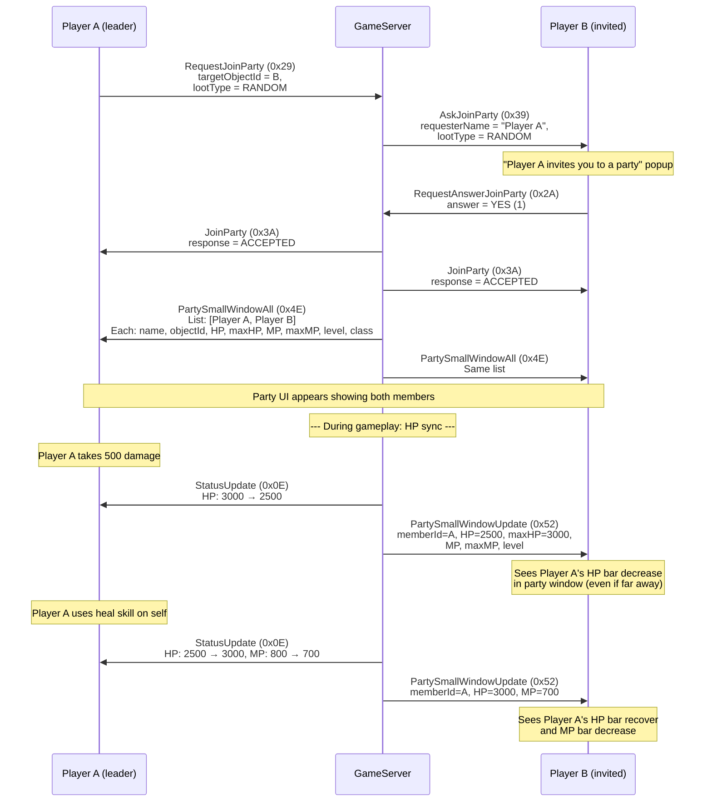
```mermaid
sequenceDiagram
    participant A as Player A (leader)
    participant GS as GameServer
    participant B as Player B (invited)

    A->>GS: RequestJoinParty (0x29)<br/>targetObjectId = B,<br/>lootType = RANDOM

    GS->>B: AskJoinParty (0x39)<br/>requesterName = "Player A",<br/>lootType = RANDOM

    Note over B: "Player A invites you to a party" popup

    B->>GS: RequestAnswerJoinParty (0x2A)<br/>answer = YES (1)

    GS->>A: JoinParty (0x3A)<br/>response = ACCEPTED
    GS->>B: JoinParty (0x3A)<br/>response = ACCEPTED

    GS->>A: PartySmallWindowAll (0x4E)<br/>List: [Player A, Player B]<br/>Each: name, objectId, HP, maxHP, MP, maxMP, level, class
    GS->>B: PartySmallWindowAll (0x4E)<br/>Same list

    Note over A,B: Party UI appears showing both members

    Note over GS: --- During gameplay: HP sync ---

    Note over A: Player A takes 500 damage

    GS->>A: StatusUpdate (0x0E)<br/>HP: 3000 → 2500

    GS->>B: PartySmallWindowUpdate (0x52)<br/>memberId=A, HP=2500, maxHP=3000,<br/>MP, maxMP, level

    Note over B: Sees Player A's HP bar decrease<br/>in party window (even if far away)

    Note over A: Player A uses heal skill on self

    GS->>A: StatusUpdate (0x0E)<br/>HP: 2500 → 3000, MP: 800 → 700

    GS->>B: PartySmallWindowUpdate (0x52)<br/>memberId=A, HP=3000, MP=700

    Note over B: Sees Player A's HP bar recover<br/>and MP bar decrease
```

### 6.7 Player Joins World — Broadcast Scenario

> When a new player enters the world, who gets notified and in what order?

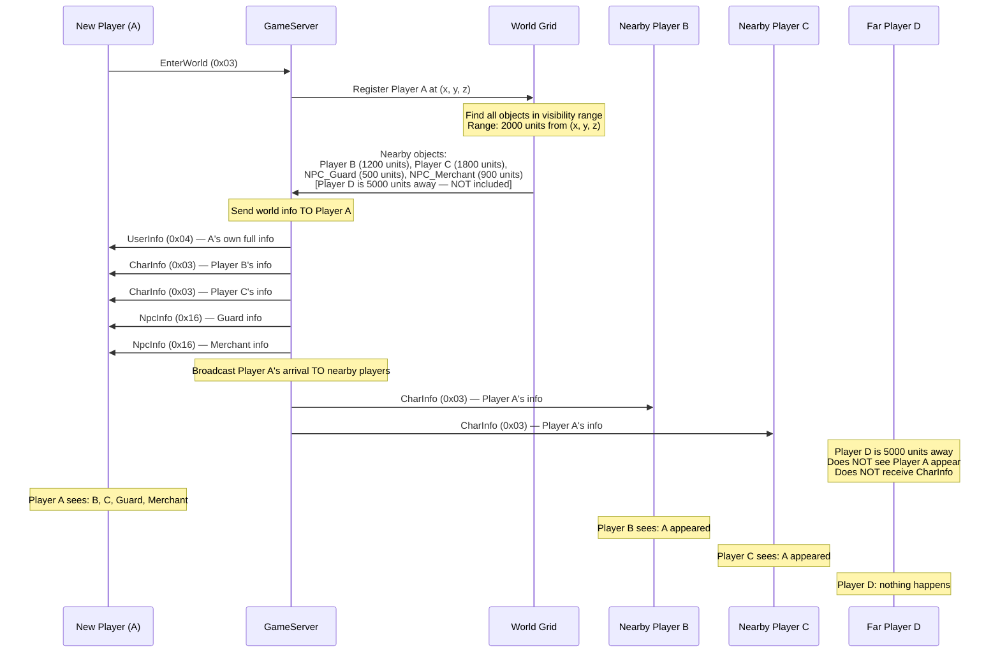
```mermaid
sequenceDiagram
    participant NEW as New Player (A)
    participant GS as GameServer
    participant W as World Grid
    participant B as Nearby Player B
    participant C as Nearby Player C
    participant D as Far Player D

    NEW->>GS: EnterWorld (0x03)

    GS->>W: Register Player A at (x, y, z)

    Note over W: Find all objects in visibility range<br/>Range: 2000 units from (x, y, z)

    W->>GS: Nearby objects:<br/>Player B (1200 units), Player C (1800 units),<br/>NPC_Guard (500 units), NPC_Merchant (900 units)<br/>[Player D is 5000 units away — NOT included]

    Note over GS: Send world info TO Player A

    GS->>NEW: UserInfo (0x04) — A's own full info
    GS->>NEW: CharInfo (0x03) — Player B's info
    GS->>NEW: CharInfo (0x03) — Player C's info
    GS->>NEW: NpcInfo (0x16) — Guard info
    GS->>NEW: NpcInfo (0x16) — Merchant info

    Note over GS: Broadcast Player A's arrival TO nearby players

    GS->>B: CharInfo (0x03) — Player A's info
    GS->>C: CharInfo (0x03) — Player A's info

    Note over D: Player D is 5000 units away<br/>Does NOT see Player A appear<br/>Does NOT receive CharInfo

    Note over NEW: Player A sees: B, C, Guard, Merchant
    Note over B: Player B sees: A appeared
    Note over C: Player C sees: A appeared
    Note over D: Player D: nothing happens
```

### 6.8 Information Visibility Rules

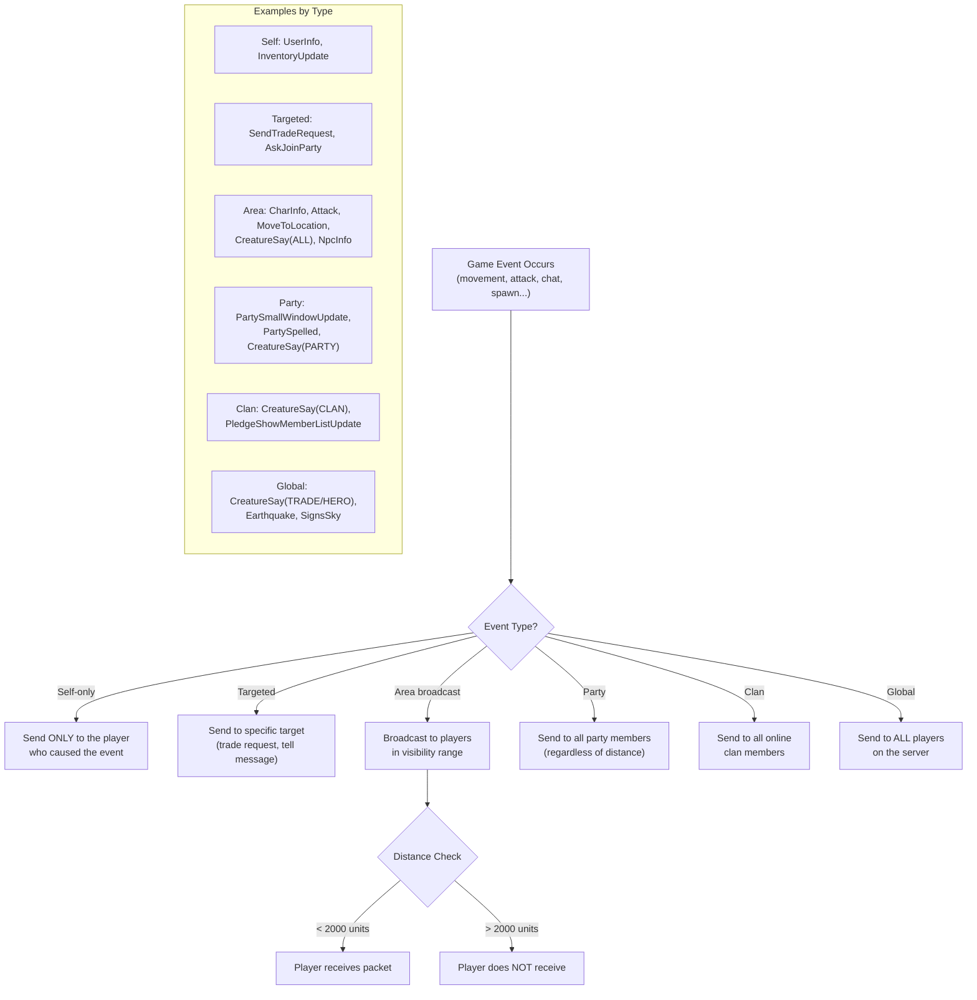
```mermaid
flowchart TD
    EVENT["Game Event Occurs\n(movement, attack, chat, spawn...)"] --> TYPE{Event Type?}

    TYPE -->|"Self-only"| SELF["Send ONLY to the player\nwho caused the event"]
    TYPE -->|"Targeted"| TARGET["Send to specific target\n(trade request, tell message)"]
    TYPE -->|"Area broadcast"| AREA["Broadcast to players\nin visibility range"]
    TYPE -->|"Party"| PARTYBC["Send to all party members\n(regardless of distance)"]
    TYPE -->|"Clan"| CLANBC["Send to all online\nclan members"]
    TYPE -->|"Global"| GLOBAL["Send to ALL players\non the server"]

    AREA --> RANGE{Distance Check}
    RANGE -->|"< 2000 units"| SEND["Player receives packet"]
    RANGE -->|"> 2000 units"| NOSEND["Player does NOT receive"]

    subgraph Examples["Examples by Type"]
        E1["Self: UserInfo, InventoryUpdate"]
        E2["Targeted: SendTradeRequest, AskJoinParty"]
        E3["Area: CharInfo, Attack, MoveToLocation,\nCreatureSay(ALL), NpcInfo"]
        E4["Party: PartySmallWindowUpdate,\nPartySpelled, CreatureSay(PARTY)"]
        E5["Clan: CreatureSay(CLAN),\nPledgeShowMemberListUpdate"]
        E6["Global: CreatureSay(TRADE/HERO),\nEarthquake, SignsSky"]
    end
```

**Visibility Range Constants:**

| Packet Type | Range (units) | Notes |
|-------------|---------------|-------|
| CharInfo / NpcInfo | 2000 | Standard visibility |
| MoveToLocation | 2000 | Movement broadcast |
| Attack / MagicSkillUse | 2000 | Combat broadcast |
| Say2 (ALL chat) | 1250 | Normal chat |
| Say2 (SHOUT) | ~10000 | Region-wide |
| Say2 (TRADE/HERO) | Unlimited | Server-wide |
| PartySmallWindowUpdate | Unlimited | Party sync |

---

> Previous: [01-crypto.md](01-crypto.md) | Next: [03-packet-reference.md](03-packet-reference.md)
