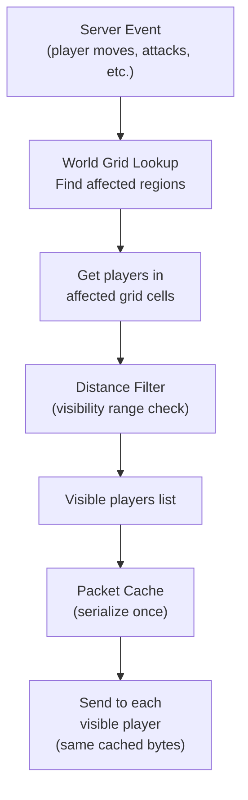
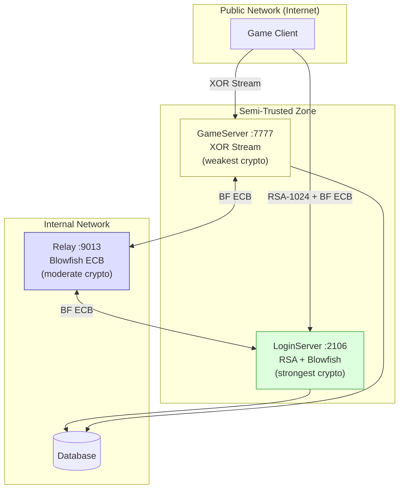

# L2 Interlude Protocol — Design, Security & Appendix

> Part 4 of [L2 Interlude Protocol Reference](README.md)
> Previous: [03-packet-reference.md](03-packet-reference.md)

---

## 9. Protocol Design Principles

### 9.1 Packet Processing Pipeline

```mermaid
flowchart LR
    A["TCP bytes"] --> B["Read 2-byte\nheader (LE)"]
    B --> C["Allocate buffer\n(header size)"]
    C --> D["Read payload\n(size - 2 bytes)"]
    D --> E["Decrypt\n(BF/XOR)"]
    E --> F["Read 1-byte\nopcode"]
    F --> G{{"0xD0 or 0xFE?"}}
    G -->|Yes| H["Read 2-byte\nsub-opcode"]
    G -->|No| I["Lookup in\nPACKET_ARRAY[opcode]"]
    H --> J["Lookup in\nExPACKET_ARRAY[sub]"]
    I --> K{{"State OK?"}}
    J --> K
    K -->|Yes| L["Create packet\ninstance"]
    K -->|No| M["Drop packet"]
    L --> N["readImpl()\ndeserialize fields"]
    N --> O["runImpl()\ngame logic"]
    O --> P["Send response\nServerPacket"]
    P --> Q["Encrypt\n(BF/XOR)"]
    Q --> R["Write to TCP"]
```

### 9.2 Encryption Layers by Connection Phase

| Phase | Connection | Encryption | Purpose |
|-------|-----------|------------|---------|
| Login Handshake | Client → LS :2106 | RSA-1024 (one-time) | Password security |
| Login Session | Client ↔ LS :2106 | Blowfish ECB (dynamic key) | Packet confidentiality |
| GS Registration | GS → LS :9013 | RSA-512 (one-time) | Key exchange |
| GS↔LS Relay | GS ↔ LS :9013 | Blowfish ECB (exchanged key) | Internal security |
| Game Session | Client ↔ GS :7777 | XOR Stream (rolling key) | Lightweight encryption |

### 9.3 Broadcast Optimization

**Key optimization:** `WritablePacket` caches the serialized buffer after first write. When broadcasting to N players, the packet is serialized **once** and the same bytes are sent N times.

---

## 10. Comparative Tables

### 10.1 LoginServer vs GameServer

| Aspect | LoginServer :2106 | GameServer :7777 |
|--------|-------------------|------------------|
| **Encryption** | Blowfish ECB (static → dynamic) | XOR Stream (16-byte rolling key) |
| **Connection States** | 3 (CONNECTED, AUTHED_GG, AUTHED_LOGIN) | 6 (CONNECTED → DISCONNECTED) |
| **Client Packets** | 6 (4 implemented) | 177 (131 regular + 46 extended) |
| **Server Packets** | 11 (8 implemented) | 269 (197 regular + 72 extended) |
| **Total Packets** | 17 | 446 |
| **Purpose** | Authentication, server selection | Gameplay, world simulation |
| **Database** | Accounts table | Characters, items, world state |
| **Session Duration** | ~10 seconds | Hours (gameplay session) |
| **Crypto Key Exchange** | RSA-1024 scrambled modulus | XOR key in plaintext KeyPacket |

### 10.2 Encryption Comparison

| Algorithm | Key Size | Mode | Purpose | Connection | Performance |
|-----------|----------|------|---------|------------|-------------|
| RSA-1024 | 1024 bit | ECB/nopadding | Password encryption | Client → LS (once) | ~115 us (CRT) |
| Blowfish | 128 bit | ECB | Login packets + relay | Client ↔ LS, GS ↔ LS | ~4.8 us per packet |
| XOR Stream | 128 bit | Custom rolling | Game packets | Client ↔ GS | ~0.1 us per packet |

### 10.3 Connection Type Comparison

| Property | Client → LS | Client → GS | GS → LS Relay |
|----------|------------|-------------|---------------|
| **Port** | 2106 | 7777 | 9013 |
| **Initiator** | Client | Client | GameServer |
| **Duration** | Seconds | Hours | Permanent |
| **Auth method** | RSA password | SessionKey relay | hexID + RSA key exchange |
| **Encryption** | Blowfish ECB | XOR Stream | Blowfish ECB |
| **Packets/sec** | 1–5 | 50–200 | 1–50 |

---

## 11. Security Considerations

### 11.1 Known Crypto Weaknesses

| Weakness | Severity | Explanation |
|----------|----------|-------------|
| **ECB mode Blowfish** | Medium | Identical plaintext → identical ciphertext. Partially mitigated by checksum. |
| **XOR stream cipher** | High | Not cryptographically secure. Known plaintext attack possible (packet format is known). |
| **RSA without padding** | Medium | No OAEP/PKCS#1. Vulnerable to Bleichenbacher attack in theory. |
| **Static Blowfish key** | Low | Hardcoded in client binary — extractable by anyone. Only protects Init packet. |
| **RSA CRT timing leak** | Low | 2.66x timing difference between CRT and fallback path reveals private key structure. CV=7.67%. |
| **Fixed key pool (20)** | Very Low | Key reuse across connections. Mitigated by XOR key shift making each stream unique. |

### 11.2 Mitigation Status

| Issue | Status | Notes |
|-------|--------|-------|
| CRT validation (Dp, Dq, Qinv) | **Validated** | Prevents panic on malformed keys |
| RSA CRT timing leak | **Acceptable** | Legacy protocol, one-shot operation, sophisticated attack required |
| ECB / XOR / static key | **Unfixable** | Inherent to L2 protocol, client compatibility required |
| Generic error responses | **Implemented** | Don't reveal whether username or password was wrong |

### 11.3 Security Architecture

**Design rationale:**
- **LoginServer** uses the strongest encryption (RSA + Blowfish) because it handles passwords
- **GameServer** uses the weakest encryption (XOR) because it handles the highest packet volume (~200/sec per player)
- **Relay** uses Blowfish because it's internal but carries sensitive SessionKey data

---

## 12. Appendix

### A. Glossary

| Term | Definition |
|------|-----------|
| **SessionKey** | 4x int32 one-time token linking Login and GameServer authentication |
| **Scrambled Modulus** | RSA modulus obfuscated with 4-step XOR/swap before sending to client |
| **Ex-packet** | Extended packet using 0xD0 (C→S) or 0xFE (S→C) prefix + 2-byte sub-opcode |
| **ConnectionState** | Finite State Machine state of a client connection (CONNECTED, AUTHENTICATED, etc.) |
| **Blowfish ECB** | Electronic Codebook mode — each 8-byte block encrypted independently |
| **XOR Stream Cipher** | Rolling XOR with 16-byte key, key[8..11] incremented by packet size |
| **encXORPass** | Accumulative XOR obfuscation applied to Init packet before Blowfish |
| **checksum** | XOR of all 4-byte words; appended before Blowfish encryption; verifies to 0 |
| **KeyPacket** | First packet from GameServer containing encryption keys |
| **Init** | First packet from LoginServer containing RSA key and Blowfish key |
| **MPCC** | Multi-Party Command Channel (alliance of multiple parties) |
| **SSQ** | Seven Signs Quest (server-wide event system) |
| **DETACHED** | Offline-trade state: TCP disconnected but character remains in world |

### B. Data Types Mapping

| Format | Java | Go | Size | LE | Description |
|--------|------|-----|------|-----|-------------|
| `c` | `byte` | `uint8` | 1 | — | Unsigned byte |
| `h` | `short` | `int16` | 2 | Yes | Signed 16-bit |
| `d` | `int` | `int32` | 4 | Yes | Signed 32-bit |
| `q` | `long` | `int64` | 8 | Yes | Signed 64-bit |
| `f` | `double` | `float64` | 8 | Yes | IEEE 754 double |
| `s` | `String` | `string` | var | Yes | UTF-16LE null-terminated |
| `b` | `byte[]` | `[]byte` | var | — | Byte array |

### C. GameServer Server → Client Packets (Complete)

#### World & Objects

| Opcode | Name | Description |
|--------|------|-------------|
| `0x01` | CharMoveToLocation | Character movement |
| `0x03` | CharInfo | Other player info |
| `0x04` | UserInfo | Self player info |
| `0x0E` | StatusUpdate | HP/MP/CP/Level update |
| `0x12` | DeleteObject | Remove object from world |
| `0x16` | NpcInfo | NPC information |
| `0x28` | TeleportToLocation | Teleport |
| `0x47` | StopMove | Stop movement |
| `0x60` | MoveToPawn | Move to target |
| `0x61` | ValidateLocation | Position validation |
| `0x62` | BeginRotation | Start rotation |
| `0x63` | StopRotation | End rotation |
| `0x4C` | DoorInfo | Door information |
| `0x4D` | DoorStatusUpdate | Door state |
| `0x8C` | ServerObjectInfo | Server object |
| `0x99` | StaticObject | Static object |
| `0xE1` | ChairSit | Sit on chair |

#### Combat

| Opcode | Name | Description |
|--------|------|-------------|
| `0x05` | Attack | Attack notification |
| `0x06` | Die | Death notification |
| `0x07` | Revive | Revive notification |
| `0x25` | ActionFail | Action failed |
| `0x29` | TargetSelected | Target selected |
| `0x2A` | TargetUnselected | Target deselected |
| `0x2B` | AutoAttackStart | Auto-attack started |
| `0x2C` | AutoAttackStop | Auto-attack stopped |
| `0x48` | MagicSkillUse | Skill used |
| `0x49` | MagicSkillCanceld | Skill cancelled |
| `0x76` | MagicSkillLaunched | Skill launched |
| `0xA6` | MyTargetSelected | Own target selected |

#### Items & Inventory

| Opcode | Name | Description |
|--------|------|-------------|
| `0x0B` | SpawnItem | Item spawned in world |
| `0x0C` | DropItem | Item dropped |
| `0x0D` | GetItem | Item picked up |
| `0x1B` | ItemList | Full inventory |
| `0x27` | InventoryUpdate | Inventory update |
| `0x4B` | EquipUpdate | Equipment update |
| `0x6F` | ChooseInventoryItem | Choose item |

#### Trade

| Opcode | Name | Description |
|--------|------|-------------|
| `0x10` | SellList | NPC sell list |
| `0x11` | BuyList | NPC buy list |
| `0x1E` | TradeStart | Trade opened |
| `0x20` | TradeOwnAdd | Own item added |
| `0x21` | TradeOtherAdd | Partner's item added |
| `0x22` | TradeDone | Trade completed |
| `0x5E` | SendTradeRequest | Trade request |
| `0x74` | TradeUpdate | Trade update |
| `0x75` | TradePressOwnOk | Own confirm |
| `0x7C` | TradePressOtherOk | Partner confirm |
| `0xD0` | MultiSellList | Multi-sell list |

#### Social & Chat

| Opcode | Name | Description |
|--------|------|-------------|
| `0x02` | NpcSay | NPC chat message |
| `0x2D` | SocialAction | Social action/emote |
| `0x2E` | ChangeMoveType | Walk/run toggle |
| `0x2F` | ChangeWaitType | Sit/stand toggle |
| `0x4A` | CreatureSay | Chat message |
| `0x64` | SystemMessage | System message |
| `0xCE` | RelationChanged | Relation changed |

#### Party

| Opcode | Name | Description |
|--------|------|-------------|
| `0x39` | AskJoinParty | Party invite |
| `0x3A` | JoinParty | Join response |
| `0x4E` | PartySmallWindowAll | All party members |
| `0x4F` | PartySmallWindowAdd | Member added |
| `0x50` | PartySmallWindowDeleteAll | Delete all windows |
| `0x51` | PartySmallWindowDelete | Member removed |
| `0x52` | PartySmallWindowUpdate | Member update |
| `0xA7` | PartyMemberPosition | Member positions |
| `0xEE` | PartySpelled | Member buffs |

#### Skills

| Opcode | Name | Description |
|--------|------|-------------|
| `0x58` | SkillList | Skill list |
| `0x8A` | AcquireSkillList | Available skills |
| `0x8B` | AcquireSkillInfo | Skill learning info |
| `0x8E` | AcquireSkillDone | Skill learned |
| `0xC1` | SkillCoolTime | Skill cooldowns |

#### Clan

| Opcode | Name | Description |
|--------|------|-------------|
| `0x30` | ManagePledgePower | Clan power management |
| `0x32` | AskJoinPledge | Clan invite |
| `0x33` | JoinPledge | Join response |
| `0x53` | PledgeShowMemberListAll | Full member list |
| `0x54` | PledgeShowMemberListUpdate | Member update |
| `0x55` | PledgeShowMemberListAdd | Member added |
| `0x56` | PledgeShowMemberListDelete | Member removed |
| `0x6C` | PledgeCrest | Clan crest image |
| `0x82` | PledgeShowMemberListDeleteAll | Clear member list |
| `0x83` | PledgeInfo | Clan information |
| `0x88` | PledgeShowInfoUpdate | Clan info update |
| `0xCC` | NickNameChanged | Title changed |
| `0xCD` | PledgeStatusChanged | Clan status change |

#### Status & Effects

| Opcode | Name | Description |
|--------|------|-------------|
| `0x7F` | AbnormalStatusUpdate | Buff/debuff update |
| `0xF3` | EtcStatusUpdate | Weight, charges, etc. |
| `0xF4` | ShortBuffStatusUpdate | Short buff bar |

#### UI & Effects

| Opcode | Name | Description |
|--------|------|-------------|
| `0x6D` | SetupGauge | Progress bar (cast, gather) |
| `0x81` | EnchantResult | Enchant result |
| `0x98` | PlaySound | Play sound |
| `0xC4` | Earthquake | Earthquake effect |
| `0xC7` | SpecialCamera | Special camera |
| `0xC8` | NormalCamera | Normal camera |
| `0xCF` | EventTrigger | Event trigger |
| `0xD4` | Dice | Dice roll |
| `0xDC` | ShowCalculator | Calculator |
| `0xEB` | RadarControl | Radar control |
| `0xED` | ConfirmDlg | Confirmation dialog |
| `0x9D` | ShowMiniMap | Mini map |

#### Auth & System

| Opcode | Name | Description |
|--------|------|-------------|
| `0x00` | KeyPacket | Encryption key |
| `0x13` | CharSelectInfo | Character list |
| `0x14` | LoginFail | Login failed |
| `0x15` | CharSelected | Character selected |
| `0x17` | CharTemplates | Class templates |
| `0x19` | CharCreateOk | Character created |
| `0x1A` | CharCreateFail | Creation failed |
| `0x23` | CharDeleteOk | Character deleted |
| `0x24` | CharDeleteFail | Delete failed |
| `0x26` | ServerClose | Server closing |
| `0x5F` | RestartResponse | Restart response |
| `0x7E` | LeaveWorld | Leave world |
| `0xD3` | NetPing | Network ping |
| `0xF9` | GameGuardQuery | GameGuard query |

#### Pets & Summons

| Opcode | Name | Description |
|--------|------|-------------|
| `0x86` | Ride | Mount ride |
| `0xB0` | PetStatusShow | Pet status |
| `0xB1` | PetInfo | Pet info |
| `0xB2` | PetItemList | Pet inventory |
| `0xB3` | PetInventoryUpdate | Pet inv update |
| `0xB5` | PetStatusUpdate | Pet status update |
| `0xB6` | PetDelete | Pet deleted |
| `0xD1` | SetSummonRemainTime | Summon time |

#### Friends

| Opcode | Name | Description |
|--------|------|-------------|
| `0x7D` | AskJoinFriend | Friend request |
| `0xFA` | FriendList | Friend list |
| `0xFB` | L2Friend | Friend info |
| `0xFC` | FriendStatus | Friend status |
| `0xFD` | FriendRecvMsg | Friend message |

#### Vehicles

| Opcode | Name | Description |
|--------|------|-------------|
| `0x59` | VehicleInfo | Vehicle info |
| `0x5A` | VehicleDeparture | Vehicle departure |
| `0x5B` | VehicleCheckLocation | Vehicle position |
| `0x5C` | GetOnVehicle | Board vehicle |
| `0x5D` | GetOffVehicle | Leave vehicle |
| `0x71` | MoveToLocationInVehicle | Move on vehicle |
| `0x72` | StopMoveInVehicle | Stop on vehicle |
| `0x73` | ValidateLocationInVehicle | Validate on vehicle |
| `0xC0` | VehicleStart | Vehicle started |

#### Extended Server Packets (prefix 0xFE)

| Sub | Name | Category |
|-----|------|----------|
| `0x01` | ExRegenMax | Status |
| `0x09` | ExColosseumFenceInfo | World |
| `0x0E` | ExPartyRoomMember | Party Room |
| `0x0F` | ExClosePartyRoom | Party Room |
| `0x10` | ExManagePartyRoomMember | Party Room |
| `0x12` | ExAutoSoulShot | Combat |
| `0x13` | ExFishingStart | Fishing |
| `0x14` | ExFishingEnd | Fishing |
| `0x15` | ExFishingStartCombat | Fishing |
| `0x16` | ExFishingHpRegen | Fishing |
| `0x17` | ExEnchantSkillList | Skills |
| `0x18` | ExEnchantSkillInfo | Skills |
| `0x19` | ExQuestInfo | Quest |
| `0x1A` | ExShowQuestMark | Quest |
| `0x1B`–`0x22` | Manor packets (8) | Manor |
| `0x23` | ExHeroList | Hero |
| `0x24` | ExServerPrimitive | Debug |
| `0x25`–`0x27` | MPCC packets (3) | MPCC |
| `0x28` | ExPledgeEmblem | Clan |
| `0x29`–`0x2C` | Olympiad packets (4) | Olympiad |
| `0x2D` | ExMailArrived | Mail |
| `0x2E` | ExStorageMaxCount | Inventory |
| `0x30` | ExMultiPartyCommandChannelInfo | MPCC |
| `0x31` | ExPCCafePointInfo | PC Cafe |
| `0x32` | ExSetCompassZoneCode | UI |
| `0x33` | ExGetBossRecord | Boss |
| `0x34`–`0x35` | Party Room packets (2) | Party |
| `0x37` | ExShowAdventurerGuideBook | UI |
| `0x38` | ExShowScreenMessage | UI |
| `0x39`–`0x3F` | Clan skill packets (7) | Clan |
| `0x40` | ExRedSky | Effect |
| `0x43` | ShowPCCafeCouponShowUI | PC Cafe |
| `0x44` | ExSearchOrc | Event |
| `0x45`–`0x46` | Cursed Weapon packets (2) | Cursed |
| `0x47` | ExRestartClient | System |
| `0x48` | ExRequestHackShield | Security |
| `0x49` | ExUseSharedGroupItem | Inventory |
| `0x4A` | ExMPCCShowPartyMemberInfo | MPCC |
| `0x4B`–`0x4F` | Duel packets (5) | Duel |
| `0x50`–`0x57` | Augment packets (8) | Augment |
| `0x5B` | ExShowSlideshowKamael | Event |

---

*Generated for the la2go project — L2 Interlude server emulator in Go.*
*Based on L2J Mobius CT 0 Interlude Java codebase (1619 files) and la2go Go implementation.*
